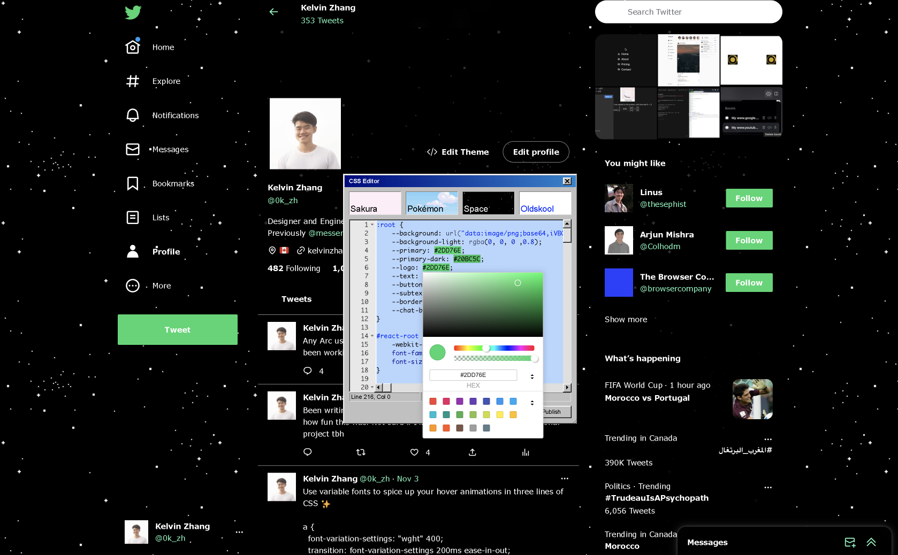

# User Themes for Twitter

Remember the days of the internet where sites like Myspace and Tumblr let you customize your own themes and share them with your friends?

User Themes for Twitter brings this ability to Twitter. Build your own theme using CSS or choose from pre-existing ones, and publish your theme for others to see when they land on your profile.

## Installation
### As an extension
Since manually copying the source can be tedious, I've packaged this boost in an extension. You can download it below:

### Installing manually
* Open https://twitter.com in Arc
* Click the + button on the bottom left and click "New Boost"
* Select "Custom"
* Replace `styles.css`, `content.js`, and `background.js` with the contents inside the [dist](./dist) folder
* Navigate to your own profile, click "Edit Theme"
* Or, navigate to [my profile](https://twitter.com/0k_zh) to see my custom theme

NOTE: Works best when you set your Twitter theme to light mode

## Developing
Since Twitter's content-security policy disallows importing scripts from other sources, we bundle all the libraries and dependencies into the `content.js` file.
Whenever you make a change to `index.js`, run `npm run build` to generate the bundled `content.js` script.